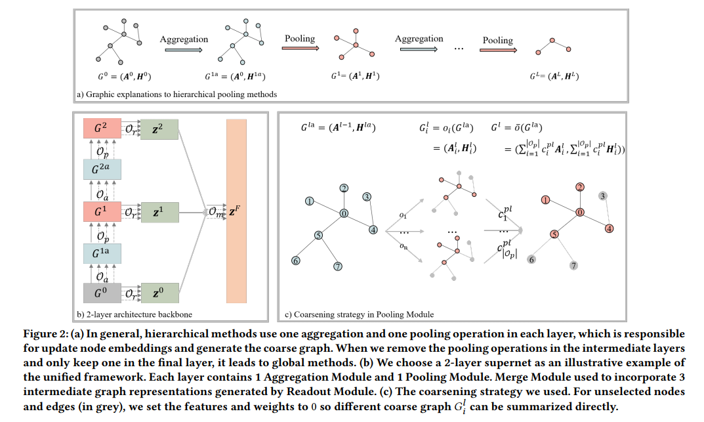

# Pooling Architecture Search for Graph Classification

#### This repository is the code for our CIKM 2021 paper: Pooling Architecture Search for Graph Classification

#### Overview
We propose a novel framework PAS to automatically learn data-specific pooling architectures for graph classification
task.  Firstly, a unified framework consisting of four essential modules is designed. Based on this framework, an effective search space is designed by incorporating popular operations from existing human-designed architectures. To enable efficient architecture search, we develop a coarsening strategy to continuously relax the search space, thus a differentiable search method can be adopted. 

    
#### Requirements
Latest version of Pytorch-geometric(PyG) is required. More details can be found in [here](https://github.com/rusty1s/pytorch_geometric)

    torch-cluster==1.5.7  
    torch-geometric==1.7.2
    torch-scatter==2.0.6  
    torch==1.6.0  
    numpy==1.17.2  
    hyperopt==0.2.5  
    python==3.7.4

#### Instructions to run the experiment
**Step 1.** Run the search process, given different random seeds.
(The 2-layer GNN on DD dataset is used as an example)

    python train_search.py  --data DD   --num_layers 2  --epochs 100

The results are saved in the directory `exp_res`, e.g., `exp_res/DD.txt`.

**Step 2.** Fine tune the searched architectures. You need specify the arch_filename with the resulting filename from Step 1.
    
    python fine_tune.py --data DD --num_layers 2 --ft_weight_decay  --ft_dropout  --ft_mode 10fold --hyper_epoch 30 --epochs 100    --arch_filename  ./exp_res/DD.txt 

#### Evaluation

The searched architectures and hyper-parameters are provided:
(DD dataset for example)

    python reproduce.py --data DD --gpu 0

#### Cite
Please kindly cite [our paper](https://arxiv.org/pdf/2108.10587.pdf) if you use this code:  

    @inproceedings{wei2021pooling,
      title={Pooling Architecture Search for Graph Classification},
      author={Wei, Lanning and Zhao, Huan and Yao, Quanming and He, Zhiqiang},
      booktitle={CIKM},
      year={2021}
    }

